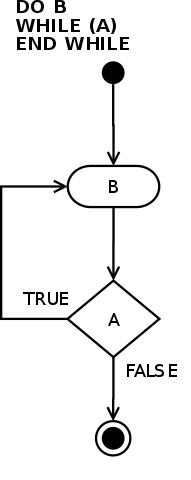

# Cấu trúc vòng lặp
Bao gồm chuỗi câu lệnh (code blocks) có thể được lặp lại nhiều lần (hoặc vĩnh viễn). Lúc lập trình mình nên để ý coi vòng lặp của mình có khả năng lặp vĩnh viễn hay không, nếu mình không có ý định cho nó lặp vĩnh viễn; chi tiết thêm trong ví dụ. Có 2 dạng chính: [`while ()`](#1-while) và [`do...while ()`](#2-do-while). Còn một dạng khác là [`for ()`](#3-for) gần giống với `do...while ()`. Theo kinh nghiệm của mình thì `for ()` sẽ được xài nhiều hơn, chủ yếu để lặp qua các [tập hợp (array).](Array.md)

[Bài tập về cấu trúc lặp.](LoopExercises.md)

## 1. While


*Image from Wikipedia*

Vòng lặp `while` thực hiện chuỗi câu lệnh (code blocks) cho tới khi *condition* là *false*. Trong biểu đồ flow diagram trên, điều kiện (*condition*) A được kiểm tra, block B được thực hiên khi A *true*. Vòng lặp được thoát khi A *false* - còn được gọi là điều kiện thoát (exit condition).

Vòng lặp `while` có thể được hiểu như cấu trúc if được lập lại nhiều lần.

Cấu trúc `while`:
    1. kiểm tra A
    2. A *true*
    3. thực hiện B
    4. kiểm tra A
    5. A *true*
    6. thực hiện B
    7. kiểm tra A
    8. A *false*
    9. exit()

### Trong Java 
Cấu trúc `while` trong Java có cú pháp (syntax):
```java
while (condition) {
    // code
}
```

**Ví dụ:** 
Chương trình in `"Hello World!"` 5 lần
```java
int i = 0; // biến i, còn gọi là index, để đếm số lần được in
while (i < 5) {
    System.out.println("Hello World!");
    i++; // lưu ý, nếu không tăng i thì vòng lặp được thực hiện vĩnh viễn (indefinitely)
}
```

**Output:**
```
Hello World!
Hello World!
Hello World!
Hello World!
Hello World!
```

**Note:** với chương trình trên, nếu ta không tăng i 1 đơn vị sau mỗi lần lặp thì vòng lặp được lặp vĩnh viễn:
```java
int i = 0
while (i < 5) {
    System.out.println("Hello World!");
}
```

**Output**
```
Hello World!
Hello World!
Hello World!
Hello World!
.
.
.
.
.
// indefinitely
```

## 2. Do while


*Image from Wikipedia*

Khác với vòng lặp `while`, `do...while` sẽ thực hiện code block bên trong ít nhất 1 lần trước khi kiểm tra *condition*. Trong flow chart ở trên, câu lệnh B được thực hiện, sau đó điệu kiện A mới được kiểm tra. Nếu A *true* thì quay trở lại thực hiện B, A *false* thì thoát vòng lặp.

Cấu trúc `do...while`:
    1. thực hiện B
    2. kiểm tra A
    3. A *false*
    4. exit()

### Trong Java
Syntax for `do while`:
```java
do {
    // code
} while (condition);
```

**Ví dụ:**
Chương trình kiểm tra user input, trong trường hợp này mình yêu cầu người dùng nhập số tự nhiên x từ 1 tới 10 (1 <= x <= 10):
```java
Scanner sc = new Scanner(System.in);

int x;
boolean validInput; // sử dụng biến này để kiểm tra coi người dùng nhập đúng không
System.out.print("Enter x: "); // hỏi lần đầu
do {
    x = sc.nextInt();
    if (x >= 1 && x <= 10) {
        validInput = true; // người dùng nhập đúng
    } else {
        System.out.println("x must be between 1 and 10: 1 <= x <= 10");
        validInput = false; // người dùng nhập x sai
    }
} while (!validInput); // lưu ý dấu chắm thang --- ! --- ở đây mình lặp khi validInput là false.
```

**Note:** vòng lặp này sẽ lặp vĩnh viễn khi và chỉ khi người dùng luôn luôn nhập x sai (x < 1 || x > 10)

## 3. For
Cấu trúc `for ()` là cấu trúc lặp có giới hạn. Cấu trúc này yêu cầu một biến thuộc số tự nhiên, ta lấy biến `i`, và sẽ lặp đến khi `i` đạt giới hạn nào đó. 

**Ví dụ**, i chạy từ 0 tới 10, ở đây vòng lặp bắt đầu ở `i = 0`, `i` tăng 1 đơn vị sau mỗi vòng lặp, và kết thúc lúc `i = 10`; thì vòng lặp này sẽ được lặp lại 10 lần.

### Trong Java
Syntax: 
```java
for (câu lệnh 1; câu lệnh 2; câu lệnh 3) {
    // code
}
```
**câu lệnh 1:** câu này được thực hiện **1 lần trước khi bắt đầu lặp.**
**câu lệnh 2:** câu này để chỉ **điều kiện để vòng lặp được tiếp tục.**
**câu lệnh 3:** câu này được thực hiện **sau mỗi vòng lặp**

**Ví dụ:**
Chương trình in biến `i` và `"Hello World!"` 10 lần:
```java
for (int i = 0; i < 10; i++) {
    System.out.println("i = " + i + " Hello World!");
}
```
**câu lệnh 1:** mình đặt biến `i = 0`.
**câu lệnh 2:** code sẽ được lặp khi `i < 10`.
**câu lệnh 3:** tăng `i` 1 đơn vị sau mỗi vòng lặp.
Bảng giá trị của `i` trong chương trình trên:

|Giá trị của `i`|Tổng số lần `"i = " + i + "Hello World!"` được in|
|---|---|
|0|1|
|1|2|
|2|3|
|3|4|
|4|5|
|5|6|
|6|7|
|7|8|
|8|9|
|9|10|

Vòng lặp dừng lại tại `i = 9` tại vì sau khi `"i = " + i + "Hello World!"` được in lần thứ 10. `i++` => `i = 10`, điều này trái với câu điều kiện `i < 10` mình đặt trong **câu lệnh 2**.

**Note:** khi lập trình mình thường đặt biến trong vòng lập `for ()` là `i` (viết tắt cho index), và thường bắt đầu ở 0. Do tập hợp (array) bắt đầu đếm ở vị trí 0. Và cũng cho dễ nhận biết điều kiện thoát (exit condition) của `for ()` là gì. Ví dụ, trong chương trình trên mình đặt **câu lệnh 1** là `i = 0`, **câu lệnh 2** là `i < 10` để chương trình lặp lại 10 lần. Nếu mình bắt đầu ở `i = 1` thì chương trình chỉ được lặp 9 lần thôi. Bảng ở dưới chứng mình điều đó:

|Giá trị của `i`|Tổng số lần `"i = " + i + "Hello World!"` được in|
|---|---|
|1|1|
|2|2|
|3|3|
|4|4|
|5|5|
|6|6|
|7|7|
|8|8|
|9|9|

**Note 2:** ngược lại, mình có thể đặt:
```java
for (int i = 1; i <= 10; i++) {
    System.out.println("i = " + i + " Hello World!");
}
```
Bảng so sánh:

|Giá trị của `i`|Tổng số lần `"i = " + i + "Hello World!"` được in|
|---|---|
|1|1|
|2|2|
|3|3|
|4|4|
|5|5|
|6|6|
|7|7|
|8|8|
|9|9|
|10|10|

Đặt kiểu này cũng giống như kiểu trên, nhưng nếu mình đặt theo kiểu ở trên thì mới có thể lặp qua các tập hợp (array) được, do array bắt đầu đếm ở vị trí 0.
