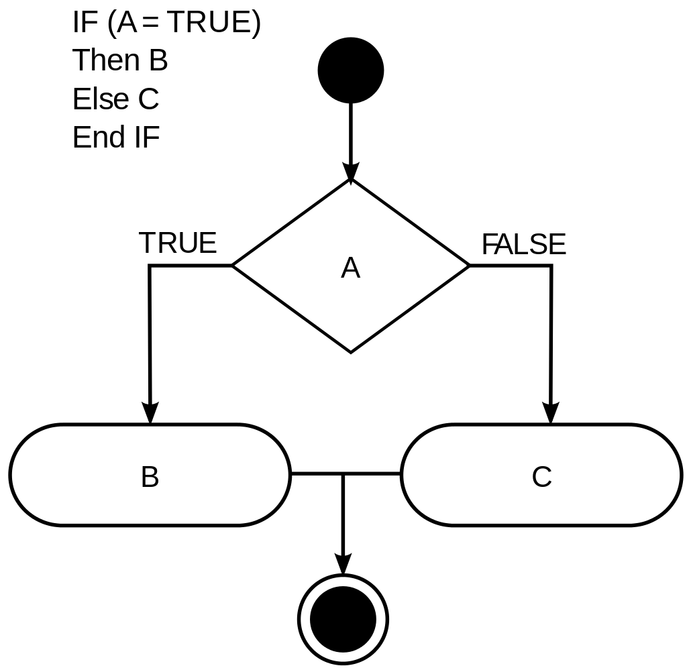

Cho chiều dài 3 cạnh tam giác là a b c số Nguyên Dương:
1. Kiểm tra a, b, c có phải là tam giác? 
2. Kiểm tra tam giác đều?
3. Kiểm tra tam giác cân?
4. Tam giác vuông?
5. Tam giác bình thường?

## [Java Guide](https://github.com/longphung/JavaExercises/blob/master/README.md)

### Câu lệnh `if () {} else {}`


*Image from Wikipedia*

Conditional statements are statements that executes different blocks of codes depending on whether *condition* is  *true* or *false*. In the flow chart above, B is executed if A is *true* and C is executed if A is *false*.
```java
if (condition) {
	// code if TRUE
} else {
	// code if FALSE
}
```
### Cấu trúc `else if`


*Image from Wikipedia*
```java
if (condition1) {
	// code ...
	// This is run if condition1 is true
} else if (condition2) {
	// code ...
	// This is run if 
	// condition1 is false and
	// condition2 is true.
} else if (condition3) {
	// code ...
	// This is run if
	// condition1 is false and,
	// condition2 is false and,
	// condition3 is true.
} else {
	// code ...
	// This is run if all the conditions are false.
}
```

**Ví dụ**: Chương trình xét điểm thi
```java
double grade = 90;

if (grade < 50) {
	System.out.println("Failed");
} else if (grade < 65) { 
	// nếu grade >= 50, và grade < 65
	// 50 <= grade < 65
	System.out.println("Passed");
} else if (grade < 75) {
	// nếu grade >= 65, và grade < 75
	// 65 <= grade < 75
	System.out.println("Credit");
} else if (grade < 85) {
	// nếu grade >= 75, và grade < 85
	// 75 <= grade < 85
	System.out.println("Distinction");
} else {
	// nếu grade >= 85
	System.out.println("High Distinction");
}
```

**Expected Output:** `High Distinction`

**Note:** Chương trình vẫn sẽ hiện `High Distinction` nếu grade > 100, nhưng trong thực tế tổng điểm 100 là cao nhất. Ngược lại, nếu grade âm thì kết quả sẽ ra `Failed` nhưng trên thực tế 0 là thấp nhất. 


